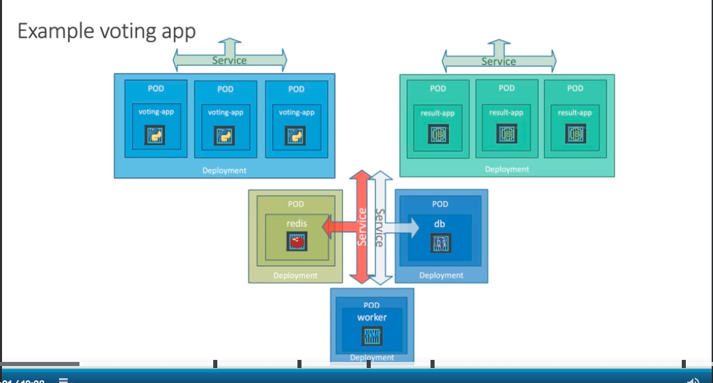

# Deployments

### Challenges with Pod Deployment:

- Deploying applications as standalone pods lacks scalability and ease of updates.
- Scaling requires manually creating more instances of a pod, leading to complexities.
- Updating the application, such as changing the container image, may result in downtime.

### Introduction to Deployments:

- Deployments are recommended for managing applications in Kubernetes.
- Deployments automatically create replica sets, facilitating scaling and updates.
- Deployments support rolling updates, rollbacks, and maintain revision history.

### Implementation of Deployments:

- The example demonstrates creating deployment YAML files for each component: voting app, Redis, PostgreSQL, worker, and
  result app.
- Deployments are specified with replicas, initially set to one for simplicity.
- Labels from pod definition files are used in the selector section of deployment templates.
- Each deployment file is created by copying the corresponding pod definition file and making necessary changes.

### Deployment Workflow:

1. **Create Deployment Files:**
    - Separate deployment files are created for each application component.
    - Deployment templates inherit labels from pod definition files.

2. **Create Deployments:**
    - Deployments are created using the `kubectl create -f` command for each deployment YAML file.
    - Services associated with each deployment remain the same.

3. **Verify Deployments:**
    - Use `kubectl get deployments` to ensure that all deployments are running successfully.

4. **Access Applications:**
    - Obtain URLs for front-end services using `minikube service` command.
    - Access the applications in the web browser.

5. **Scale Deployments:**
    - Scaling deployments is demonstrated using the `kubectl scale` command.
    - The number of replicas for the voting app is increased to three.
    - The impact of scaling is observed by refreshing the application page, showing different pods serving requests.

### Conclusion:

Deployments provide a more robust and scalable approach to managing applications in Kubernetes. The ease of scaling,
updating, and maintaining revision history makes deployments a preferred choice for production-ready applications. The
example illustrates how to transition from standalone pods to deployments for improved application management.