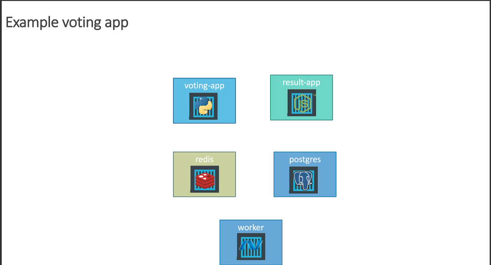
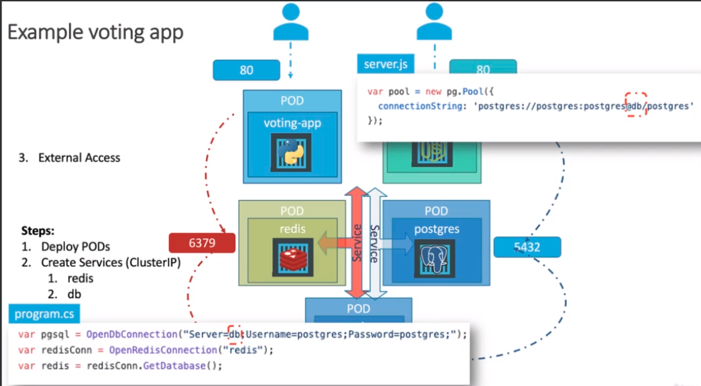
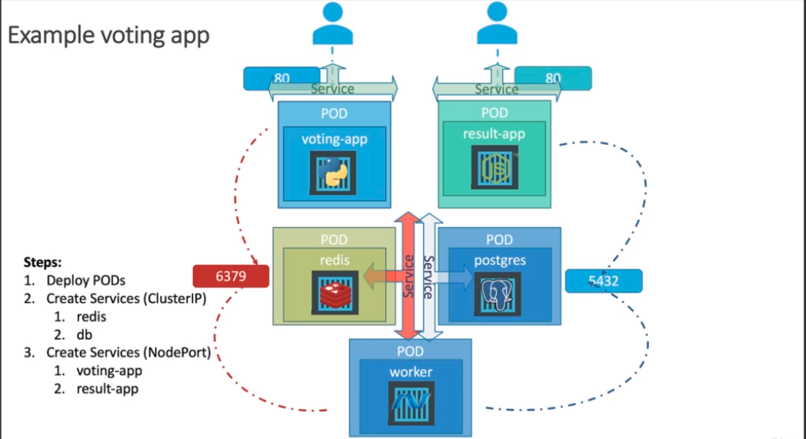
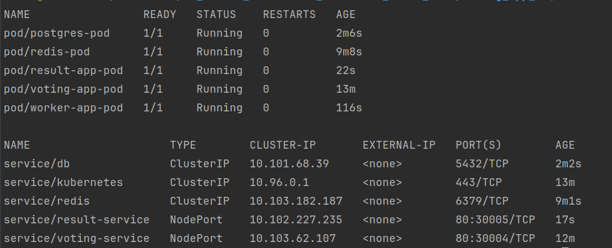

# Summary:

In this tutorial, the user creates a multi-tier application called "Voting App" in Kubernetes. The application comprises
several components, each represented by a Pod, and corresponding services to expose and connect these components. The
components include the "voting app," "result app," "Redis," "PostgreSQL," and a "worker" pod.

Here are the key steps and components created:




1. **Pod Definitions:**
    - Pods are defined for each component using YAML files (e.g., voting-app-pod.yml, result-app-pod.yml, redis-pod.yml,
      postgres-pod.yml, worker-pod.yml).
    - Each pod has metadata, including a name and labels for identification and grouping.
    - Containers within the pods use custom images hosted on Docker Hub, and container ports are specified.

2. **Service Definitions:**
    - Services are defined to expose and connect the pods.
    - Internal services (e.g., Redis, PostgreSQL) use ClusterIP type for internal communication.
    - External services (Voting App and Result App) use NodePort type to be externally accessible.
    - Each service specifies labels (selectors) to associate with pods.
    - Ports are defined for each service, specifying target ports and ports on the service.

3. **Deployment:**
    - Pods and services are created using `kubectl create` commands with the respective YAML files.

4. **Verification:**
    - The status of pods and services is checked using `kubectl get pods` and `kubectl get services`.
    - The user tests the voting application by accessing the specified NodePort URLs for the Voting App and Result App
      services.
    - Votes are cast, processed by the pods, stored in the PostgreSQL database, and reflected in the result app.

1. **Labels:**

- The `labels` in the `metadata` section of the Pod and Service definitions should be consistent within each
  application stack. This allows for grouping related components.
- Example:

```yaml
  metadata:
  labels:
    app: voting-app
    name: demo-voting-app
```

2. **Container Images:**

- The container image specified under the `containers` section in the Pod definitions should be correct for each
  component. Ensure that the images correspond to the intended functionality.
- Example:

```yaml
  containers:
    - name: voting-app
      image: codecloud/example-voting-app_vote:v1
```

3. **Container Ports:**

- The `containerPort` specified in the `ports` section of the Pod definitions should match the port on which the
  application inside the container is running.
- Example:

```yaml
  ports:
    - containerPort: 80
```

4. **Selector for Services:**

- The `selector` in the Service definitions should match the labels of the corresponding Pods. This is crucial for
  the Service to correctly route traffic to the associated Pods.
- Example:

```yaml
  selector:
  app: voting-app
  name: demo-voting-app
```

5. **Exposed Ports in Services:**

- The `targetPort` and `port` in the `ports` section of the Service definitions should match the `containerPort`
  specified in the Pod definitions. Additionally, for NodePort services, ensure that `nodePort` values are unique
  across services.
- Example:

```yaml
  ports:
    - targetPort: 80
      port: 80
      nodePort: 30004
```

# Commands

Below are the commands that would be executed in the terminal to run the pods and services based on the
provided YAML definitions:

1. **Create Voting App Pod and Service:**
```bash
kubectl create -f voting-app-pod.yaml
kubectl create -f voting-app-service.yaml
```

2. **Create Redis Pod and Service:**
```bash
kubectl create -f redis-pod.yaml
kubectl create -f redis-service.yaml
```

3. **Create PostgreSQL Pod and Service:**
```bash
kubectl create -f postgres-pod.yaml
kubectl create -f postgres-service.yaml
```

4. **Create Worker Pod:**
```bash
kubectl create -f worker-pod.yaml
```

5. **Create Result App Pod and Service:**
```bash
kubectl create -f result-app-pod.yaml
kubectl create -f result-app-service.yaml
```

6. **Check Status of Pods and Services:**
```bash
kubectl get pods,services
```



These commands assume that you are in the directory containing the YAML files and that `kubectl` is configured to
interact with your Kubernetes cluster.

Note: Make sure to adjust the file names if they differ in your actual project directory. Additionally, running the
services with `kubectl create` is a basic example; in a production environment, you might want to use more sophisticated
deployment strategies.


